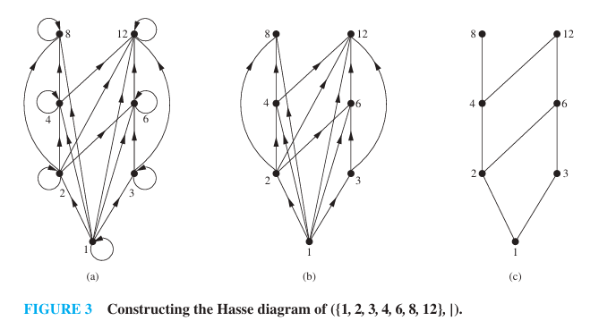

### 9.6 partial ordering:

1. **偏序的定义**：if it is **reflexive, antisymmetric,and transitive**.
2. **偏序集的定义**:一个有偏序关系的集合叫做偏序集,使用(S,R)来标记这个偏序集。
    一些例子： 
    - 大于等于关系是偏序关系；
    - 正整数集合在整除关系下是一个偏序集；
    - 集合的包含关系是一个偏序集；
    - 严格大于关系不是一个偏序关系。
---

集合中的元素并非都能进行偏序的比较。例如二不能整除三，三也不能整除二。
(使用\&preceq;在md中打出这个偏序符号&preceq;)
1. **可比较的定义**:如果a&preceq;b or b&preceq;a就称这两个元素是可比较的(comparable)，否则称为不可比较的。
2. **全序集的定义**：在某个偏序关系意义下，集合中任意两个元素都是可比较的。那么就称这个集合是全序集(totally ordered set)
3. **全序关系的定义**，满足全序集的那个偏序关系。(totally ordering)
    注：全序集也被称为链(chain);
    一些例子
    - 整数集合在小于等于关系下是一个全序集；
    - 正整数集合在整除关系下不是一个全序集。

---

全序集已经有了很强的有序性，但是我们还有更强的良序(well-ordered)

1. **良序集的定义**：对于某个**全序集，其任何子集都有最小值**，那么这个就称这个集合是良序的。也即良序集。
   一个例子：
   - 字典序在由正整数组成的二元有序数对的集合中是一个良序关系；
   - 整数集合在小于等于关系下不是良序集，因为其负数部分组成的子集没有最小值。

2. **良序推断原理(the principle of well-ordered induction)**：数学归纳法的另一种表达。原文如下：
---
对于笛卡尔积下的集合，也有相应的偏序存在，字典序(lexicographic order)就是一种。

1. **字典序的定义**：简单来讲，就是具有优先级的偏序关系：按照从左到右的顺序每一个分量对应着去看，只要某个分量能判断偏序关系，那么就以这个为结果。 
   一个例子： 
    - 字典排列是按照字母表的偏序构建的顺序。这也是字典序名称的来源。

---

使用有向图来表示偏序关系是一种非常好的方法。然而过于多的关系不利于我们进行信息的处理。我们需要简化图，这就是hasse diagram的设计初衷。

hasse图的简化思路，就是根据偏序本身的性质把那些不需要的边全部去掉，只留下需要的边，其实就是根据偏序本身的性质：反自反性，对称性，传递性。
**注意**：hasse图还**将有向图转化为了无向图**，这是在默认接受了**低节点指向高节点**的规则下才形成的。
以下是一个例子：

这个图的关系是整除关系。

---

考虑完了有序，我们就可以以此为基础来考虑最值了。

1. **极大值(maximal)的定义**：在一个偏序集中，大于所有与之可比较的元素的那个元素。
2. **极小值(minimal)的定义**:跟上面差不多。
3. **最大值(greatest element)的定义**：在一个偏序集中，比其他元素都“大于等于”的元素。(只需要这个元素和其他元素都可比，不一定必须是全序集)
    一些例子：
    - 幂集P(S)(偏序关系是集合的包含关系)中，S是最大值，空集是最小值。
      - 用hasse diag来表示就是：
    - 一个正整数的所有正因子(偏序关系是整除关系)中，它本身是最大值，1是最小值。
    - 在整除关系下的正整数集没有最大值，但有最小值1；
---

除了集合整体的最值，我们还可以考虑子集的最值。

1. **上界(upper bound)的定义**：在某一偏序集中，**“大于等于”此偏序集一子集中所有元素**的那个元素。
2. **下界(lower bound)的定义**:与上面类似。
3. **上确界(least upper bound)的定义**:所有上确界中最小的那个。
4. **下确界(greatest lower bound)的定义**：所有下确界中最大的那个。

对于寻找上下确界，等同于在新的偏序子集里面寻找最值。

一些例子：
- 对于有限正整数集在整除关系下寻找下确界，相当于求最大公因数；上确界相当于求最小公倍数。
---
接下来我们开始研究具有上下确界的结构。

1. **lattice的定义**：若对于某一偏序集，其任意一对元素都具有上下确界，那么就称这个偏序集为lattice。
    一些例子:
    - 全体正整数组成的集合在整除关系下是一个lattice。正如我们之前所提到的，最小值是最大公因数，最大值是最小公倍数。
    - 有向无环图必然是一个lattice；

在讨论拓扑排序之前，还有一个小定义需要了解：

2.**相容(compatible)的定义**：其实就是全序关系&preceq;包含了偏序关系;(或者我们可以称为包含)
3. **拓扑排序(topological sorting)的定义**：从偏序关系建立起的全序关系称为拓扑排序。也就是并不添加新的偏序关系，一条道走到黑(bushi);
 
接下来介绍拓扑排序的算法：
为了建立拓扑排序，我们需要以下引理
**一条引理：**
- 任何有限非空偏序集至少有一个极小值。

**建立拓扑排序的算法**：每次将极小值从偏序集中删除，删除的顺序即为拓扑排序。

其实画图更方便，没有入度的节点就是备选节点。

---
## 10 Graph:
这一章我们学习图论相关内容。
### 10.1 Graph and Graph Model:
1. **图的定义**：图是由边和点构成的非空集合(记作**G(V,E)**，v代表vertices，e代表edges)，每条边都有两个点，称为**端点(endpoint)**，边使点**相连(connected)**
   - 图的点或者边可以是无限个，这样的图称之为无限(infinite graph)图；否则为有限图(finite graph);

图的类型有非常非常多，我们由简到繁地来进行说明。
1. **简单图(simple graph)的定义**：对于一个图，如果每两个点之间最多有一条边、每条边连接的都是两个不同的点，那么就称这个图是简单图。
2. **多重图(multigraph)的定义**：若两点之间最多可以连接多条边，那么就称这样的图是多重图。
3. **伪图(pesudograph)的定义**：该图中的点有可能存在自己到自己的多条边。
4. **无向图和有向图的定义**：图中的边是有方向的/无方向的。
   有向图的一些细节：
   - 有向边使用有序节点对来表示，(u,v)表示从u出发(start)，指向(end)v;
5. **有向简单图的定义**：就是给简单图加上了方向。
6. **有向多重图的定义**：就是给多重图加上了方向。
7. **混合图的定义**：既有有向边，也有无向边。
 一个总结：
 - 

---

接下来我们看看使用图建模的一些问题。

1. social networks：
   - acquaintanceship and friendship graphs:这是一个无向图，点代表人，边代表关系。
   - Influence graph:这是一个有向图，影响是有主体和客体的； 
